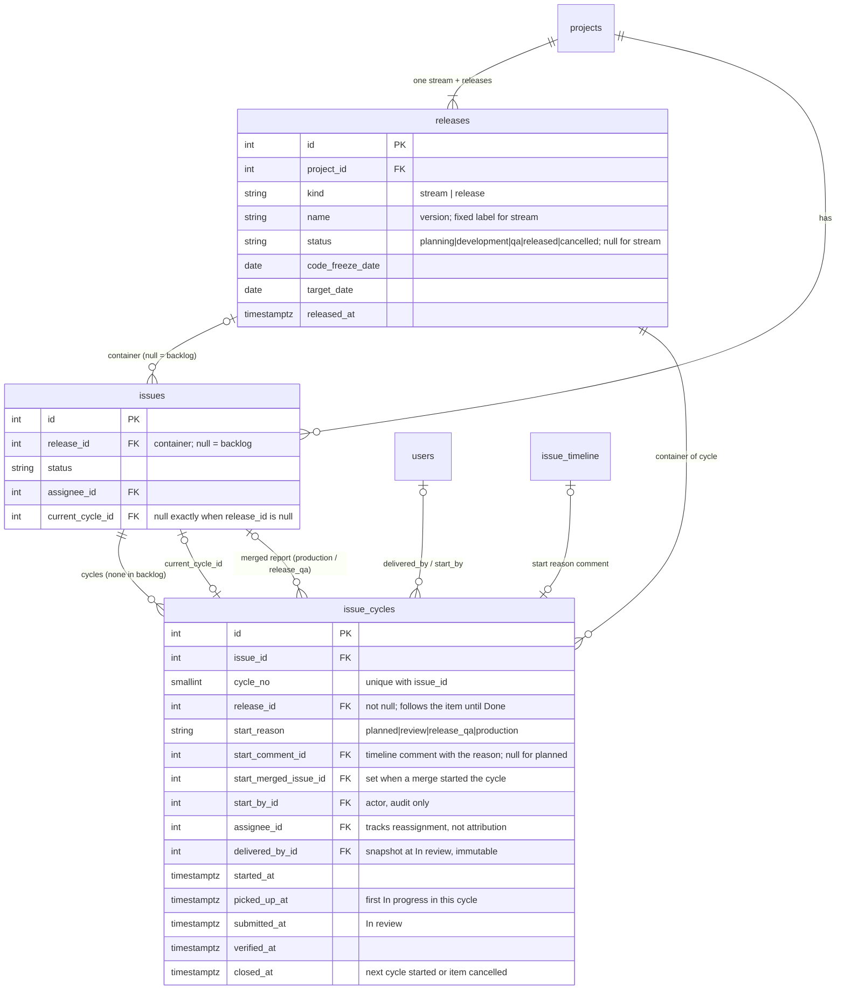

# Releasewatch — Work Item Cycle Model

> **Status:** Agreed (2026-09-30). Companion to [PRD v3](prd-v2.md) (§8.9, §10.14, BR-49, BR-51–BR-66).
> **Replaces:** the Phase 1 regression model (`regression_history`, `is_regression`, `regression_count`) and PRD v2.2 BR-24, BR-25, BR-49 (old), BR-50 (old).
> **Implemented by:** [08a](08a-release-stream-cycles.md) Part 3; the queue rule in [10](10-personal-queue.md).

---

## 1. Context

- Every project has **one Stream** (system-created, always open; each item ships on its own when Done) and any number of **Releases** (Planning → Development → QA → Released, or Cancelled; their items ship together). Milestones and project kinds do not exist.
- The Stream is stored as a row in `releases` with `kind = stream`, so every container is a `release_id`.
- The **backlog** is "no container". A backlog item cannot move to In progress: it is placed in the Stream or a Release first (as To do), and the developer then moves it to In progress.
- Bugs and tasks share one QA gate: `To do → In progress → In review → Done`. `In review → Done` only by verification, by someone other than the person who sent it to review. There is no `In progress → Done`.
- Done items never change container. A release with a Done item cannot be cancelled. Shipping a release moves every item that is not Done to the backlog.
- There are no bulk status changes.

---

## 2. Definitions

The model has **one term: Cycle.** "Return" in the PRD names what starts a later cycle; it is not a separate entity.

**Cycle.** One pass of work on an item until it is delivered: picked up, worked, sent to In review, verified. A cycle belongs to one item and one container.

- **A cycle exists only while the item has a container.** A backlog item has no cycle.
- The first cycle starts when the item is **placed in a container** (created in one, accepted into one in triage, or moved into one from the backlog), with `start_reason = planned`. A bug filed directly into a container has its first cycle while it is still in triage.
- Every later cycle starts because the work came back. **Why a cycle started** is an attribute of the cycle: `start_reason` (§3).
- **Moving an item to the backlog deletes all of its cycles.** Placing it again starts from cycle 1. When work is planned again, its earlier cycles are not relevant.
- An item that is placed, built, verified and shipped without problems has exactly one cycle.
- Applies to **bugs and tasks** alike.

**Shipped.** Whether the item's work is on production:

| Item's container | Shipped when |
|---|---|
| Stream | The item is Done |
| Release | The item is Done and the release is Released |

**Escape.** A problem that passed every QA layer and **reached production**, then was found there. It is the cycle reason `production`.

---

## 3. Start reason

| `start_reason` | When a cycle starts with it | Status move | What failed | UI name (proposed, PRD §17.10) |
|---|---|---|---|---|
| `planned` | The item is placed in a container. Always cycle 1 | — | — | — |
| `review` | Item-level QA rejects the delivered work. Comment required | `In review → To do` | The delivered work | Reject |
| `release_qa` | The item is Done in a Release that is not yet Released, and release-level QA finds a problem with it. Comment required | `Done → To do` | Item-level verification | Regression |
| `production` | The item is shipped and a problem is found on production. Recorded through **Problem on production** (tech team) or a triage **merge** of a new report into the item | `Done → To do` | All of QA | Escape |

- `start_reason` is never null.
- `release_qa` exists only in Releases. In the Stream, Done means shipped.
- The reason is **computed and stored when the cycle starts**, never recomputed. The item can move to another container afterwards, and then the original state can no longer be derived.
- Reasons are **not monotonic**. After an escape, the re-fix can be rejected in review again.
- Every return sends the item to **To do**. The assignee picks it up again by moving it to In progress; that move is the explicit hand-back.
- A merge into an item that is not Done (New, Needs info, To do, In progress, In review, Blocked) or is Cancelled starts **no** cycle.

### Example

Item placed in Release R1, rejected twice in review, shipped, escapes, moves to the Stream, re-fix rejected once, ships.

| Cycle | Container | `start_reason` |
|---|---|---|
| 1 | R1 | `planned` |
| 2 | R1 | `review` |
| 3 | R1 | `review` |
| 4 | Stream | `production` (attributed to R1, the container of cycle 3) |
| 5 | Stream | `review` |

If a PM then moved the item to the backlog before cycle 5 was delivered, all five cycles would be deleted, and placing it again would start a new cycle 1 (`planned`). See §7.1 for the one case where this loses information.

---

## 4. Rules

**CY-01** **Container of a cycle.** Every cycle stores its container (`release_id`, not null). While the cycle is open and the item is not Done, it follows the item when the item moves between containers. A Done item never moves, so the container of delivered work is fixed.

**CY-02** Every cycle stores its `start_reason`, computed when the cycle starts.

**CY-03** An item returned from production whose container is a Released release moves **automatically to the Stream** when the new cycle starts. The PM may then move it to an open release. A Released release never holds an open item.

**CY-04** **Escape attribution.** An escape counts against the **container that shipped the failed work**: the `release_id` of the previous cycle (`cycle_no − 1`). Nothing extra is stored.

**CY-05** **Who delivered the work.** When an item moves to In review (from 09a: to To review or In review, whichever comes first), the cycle snapshots the item's current assignee into `delivered_by_id`. It never changes afterwards.
- It is **never the actor** of the status change. An Admin or CTO changing the status does not become the author of the work.
- If the item has no assignee at that moment, `delivered_by_id` stays empty and does not fall back to the actor.
- "Whose work came back" for cycle N = `delivered_by_id` of cycle N − 1.

**CY-06** **QA side has no per-person attribution.** `start_by_id` is kept as the actor, for audit and timeline display only.

**CY-07** "A person cannot verify what they sent to review" is checked against the actor. It is a guard, not a metric.

**CY-08** **There are no bulk status changes.** Returns happen one item at a time, with a reason.

**CY-09** When reports are built (Phase 3), they never sum start reasons into one number. "5 regressions" is not reported; "3 review, 0 release_qa, 2 production" is.

**CY-10** **Timing.** Work time is measured from `picked_up_at` (first move to In progress in the cycle), not from `started_at`. Waiting in To do is not work time.

**CY-11** *(Superseded by [09a](09a-review-queue-and-rejected.md) / [ADR 0004](../adr/0004-rejected-is-a-status.md): returned work has the status **Rejected**, and items past cycle 1 show a cycle badge.)* **Returned marker.** There is no Returned status and no extra Kanban column. An item whose current cycle has `start_reason <> planned` and `submitted_at IS NULL` shows a **returned marker** in To do and In progress: the reason, the return number (`cycle_no − 1`), and the reason comment on hover (loaded lazily). Both inputs are written once, so nothing has to be cleared.

**CY-12** Starting a cycle with any reason other than `planned` notifies the assignee with the reason and the comment.

**CY-13** **Queue position.** A returned item re-enters its assignee's personal queue at the position it had before it left, never above the pinned items. An item rejected from In review never left the queue and keeps its place.

**CY-14** **Backlog.** Moving an item to the backlog (by a PM, or by shipping its release) deletes its cycles and clears `current_cycle_id`.

---

## 5. Metrics (Phase 3)

Reports are deferred to Phase 3 (PRD §16). The data above supports:

| Metric | Scope | Definition |
|---|---|---|
| Review rejects | Release, project | Cycles with `start_reason = review` |
| Release-QA catches | Release, project | Cycles with `start_reason = release_qa` |
| Escapes | Release (by CY-04), project, team | Cycles with `start_reason = production` |
| Escape rate | Release, project, period | Items escaped ÷ items shipped |
| First-pass rate | Release, project | Items shipped with exactly one cycle ÷ items shipped |
| Cycles per item | Release, project | Mean cycles before first ship (minimum 1) |
| Pickup wait | Release, project | `picked_up_at − started_at` for cycles with `start_reason <> planned` |

**Phase 1 reports** (release report, regressions, component fragility, dashboard, contributions) keep their meaning in Phase 2: they read cycles of **bugs** in containers with `kind = release` whose `start_reason` is `review` or `release_qa`. That is exactly the set Phase 1 recorded as regressions.

---

## 6. Data model

One table holds cycles, including why each one started. It replaces `regression_history`, whose relation to the cycle it opened was already one-to-one in Phase 1 (`issue_cycles.regression_history_id`).

| Need | Source |
|---|---|
| Returned marker in lists | `current_cycle.start_reason`, `current_cycle.submitted_at` (one PK join) |
| "Returned N" | `current_cycle.cycle_no − 1` |
| Escape attribution | `release_id` of cycle `cycle_no − 1` |
| Whose work came back | `delivered_by_id` of cycle `cycle_no − 1` |
| Per-reason reports | `GROUP BY start_reason` on `issue_cycles` |

- `issues.current_cycle_id` is the only mutable pointer. It is written when a cycle starts and cleared when the item moves to the backlog. Invariant: `current_cycle_id IS NULL` ⇔ `release_id IS NULL`.
- `issues.is_regression`, `issues.regression_count` (in `issue_bugs` since 03a), `issue_cycles.regression_history_id`, and the per-cycle `time_to_*_h` columns are dropped. Durations come from `DurationService` (03a).
- `start_reason` values live in the enum modules (`app/domain/enums.py`, `src/lib/domain.js`) with the parity test (03a). No hardcoded strings.

**Phase 1 defects fixed by this model**
- `regression_service.record_regression` sets `previous_fix_by_id` from `last_fix_event.actor_id`. That is the actor of the status change, so an admin or CTO changing a status is credited with the fix (CY-05).
- `IssueCycle.assignee_id` is updated on every reassignment, including after In review, so it cannot serve as the author of the fix either.

### Migrations

No data migration. Phase 2 has not shipped and was mid-development when this model was decided; the Phase 2 migrations are rewritten to create this shape directly, and dev databases are rebuilt ([08a](08a-release-stream-cycles.md)).

---

## 7. Deferred

### 7.1 Escape lost on move to backlog (Phase 3)

An item ships in R1, escapes (cycle with `production`), returns to To do, and a PM then moves it to the backlog. Its cycles are deleted (CY-14), so R1's escape disappears from the data. This is accepted for Phase 2 as a rare exception and must be revisited when Phase 3 builds the reports.

### 7.2 Other points for Phase 3

- Whether task cycles and production returns feed component fragility.
- Whether any cycle metric is shown per developer (`delivered_by_id` allows it; individual performance scoring is a PRD non-goal).
